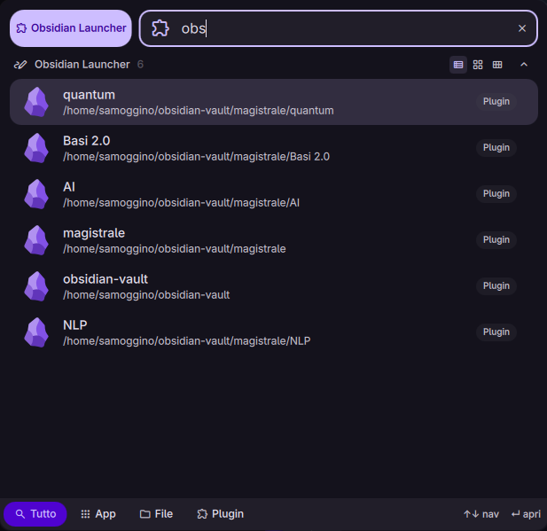

# Obsidian Launcher for DankMaterialShell

A plugin for [DankMaterialShell](https://github.com/AvengeMedia/DankMaterialShell) that allows you to quickly open your Obsidian vaults.



## Features

* **Quick Search**: Find your vaults by name.
* **Flatpak Support**: It supports both native and Flatpak Obsidian installations.
* **Always Active Mode**: Option to show vaults directly in the launcher without a specific trigger.
* **Custom Trigger**: Define your own keyword (e.g., `\obs`, `ob`) to filter results.

## Installation

1.  Ensure you have **Dank Material Shell** installed and working. 
2.  The easiest way to install is through the DMS Plugin Registry.
3.  Alternatively, clone this repository into your DMS plugins folder:
    ```bash
    cd ~/.config/DankMaterialShell/plugins/
    git clone https://github.com/Samoggino/dankObsidian
    ```

## Requirements

* **Quickshell**: The framework powering the shell.
* **Obsidian**: Installed via Flatpak or natively (uses `xdg-open`).

## How I Developed It

I developed this plugin using LLMs like **Gemini** and **Qwen**, because I had no prior experience with *QML*.
I designed this plugin with portability in mind:

* It is compatible with both **native** and **Flatpak** versions of Obsidian (I tested both, but I primarily use the Flatpak version).
* The code has been tested exclusively on CachyOS with Hyprland, but it should work on any Linux distribution that supports Flatpak or `xdg-open`, and any compositor that supports Quickshell.

## Credits & License

* Inspired by the [DMS VSCode Launcher](https://github.com/sr-tream/dms-vscode-launcher) logic.
* This project is licensed under the **MIT License** - see the [LICENSE](LICENSE) file for details.

Developed with ❤️ by Samoggino on CachyOS, I hope this plugin to be useful for the Obsidian community and DMS users.