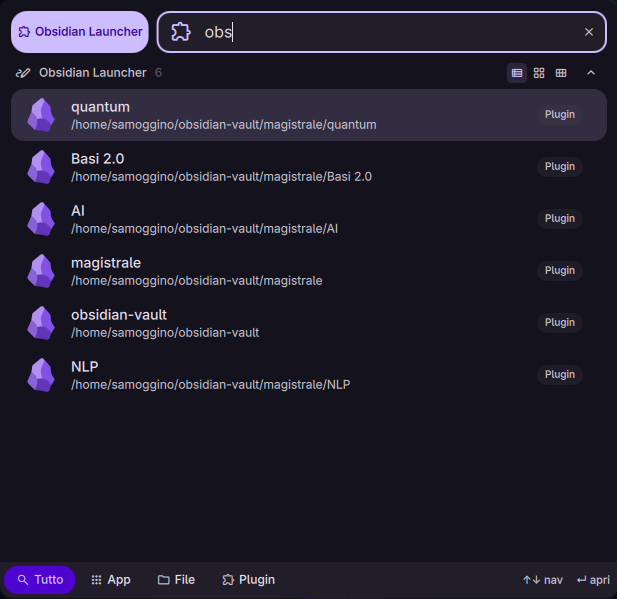

# Obsidian Launcher for DankMaterialShell

A lightweight and efficient launcher plugin for [Dank Material Shell](https://github.com/AvengeMedia/DankMaterialShell) that allows you to quickly search and open your Obsidian vaults.



## Features

* **Quick Search**: Instantly find your vaults by name.
* **Flatpak Support**: Built-in toggle to support both native and Flatpak Obsidian installations.
* **Always Active Mode**: Option to show vaults directly in the launcher without a specific trigger.
* **Custom Trigger**: Define your own keyword (e.g., `obs`, `ob`) to filter results.

## Installation

1.  Ensure you have **Dank Material Shell** installed and working.
2.  The easiest way to install is through the DMS Plugin Registry.
3.  Alternatively, clone this repository into your DMS plugins folder:
    ```bash
    cd ~/.config/DankMaterialShell/plugins/
    git clone [https://github.com/Samoggino/dms-obsidian-launcher](https://github.com/Samoggino/dms-obsidian-launcher)
    ```

## Configuration

You can configure the plugin directly from the DMS Settings interface:
* **Enable/Disable**: Toggle the plugin on or off.
* **Is Flatpak**: Enable this if you are using the Obsidian Flatpak version.
* **Search Trigger**: Set the keyword used to activate the vault search.
* **Always Active**: If enabled, vaults will be visible as soon as you open the launcher.

## Requirements

* **Quickshell**: The framework powering the shell.
* **Obsidian**: Installed via Flatpak or natively (uses `xdg-open`).

## Credits & License

* Inspired by the [DMS VSCode Launcher](https://github.com/AvengeMedia/dms-plugin-registry) logic.
* This project is licensed under the **MIT License** - see the [LICENSE](LICENSE) file for details.

Developed with ❤️ by Samoggino on CachyOS.
